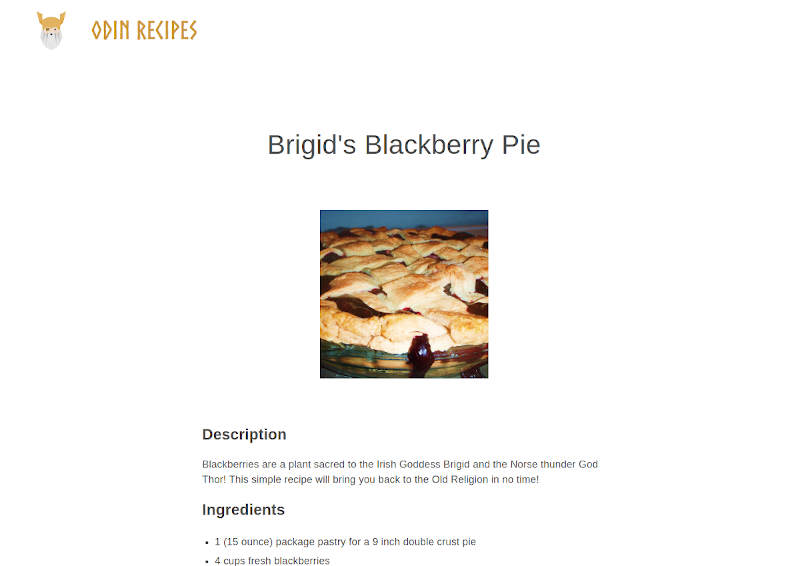

# The Odin Project - Odin Recipes

This is a basic page done as a part of The Odin Project's new curriculum. I thought I should do these lessons because I'm a completist.

## Table of contents

- [Overview](#overview)
  - [Description](#description)
  - [Screenshot](#screenshot)
  - [Links](#links)
- [My process](#my-process)
  - [Built with](#built-with)
  - [The process](#the-process)
  - [Further development](#further-development)
  - [Useful resources](#useful-resources)
- [Author](#author)

## Overview

### Description

The aim of this project was to understand the basics of HTML, with focus on links, images and lists.

### Screenshot

### Links

- [Solution](https://github.com/je-jo/odin-recipes)
- [Live Site](https://je-jo.github.io/odin-recipes/)

## My process

### Built with

- Semantic HTML5 markup

### The process

This was an easy and relaxing project, seeing I've already done the old lessons. But this is my first multi-page "website".

### Future development

- Add styling.
- Use Dev Tools to "steal" the styling of The Odin Project site itself.

### Useful resources

- [allrecipes.com](http://www.allrecipes.com) - For the recipes :P

## Author

- [Github](https://github.com/je-jo)
- [Frontend Mentor](https://www.frontendmentor.io/profile/je-jo)
- [Codepen](https://codepen.io/je-jo)

